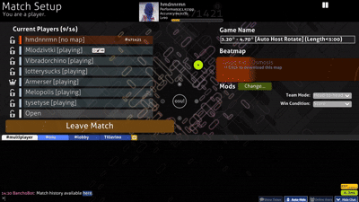
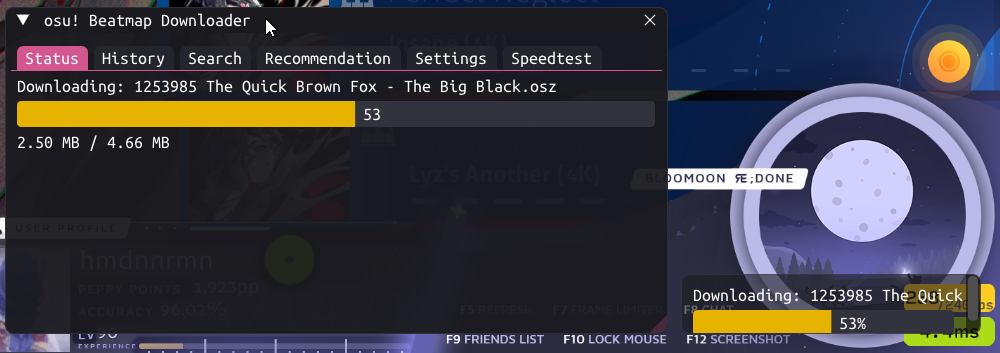
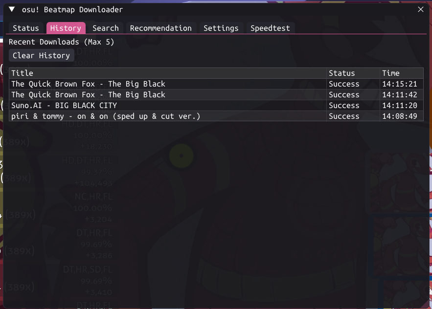
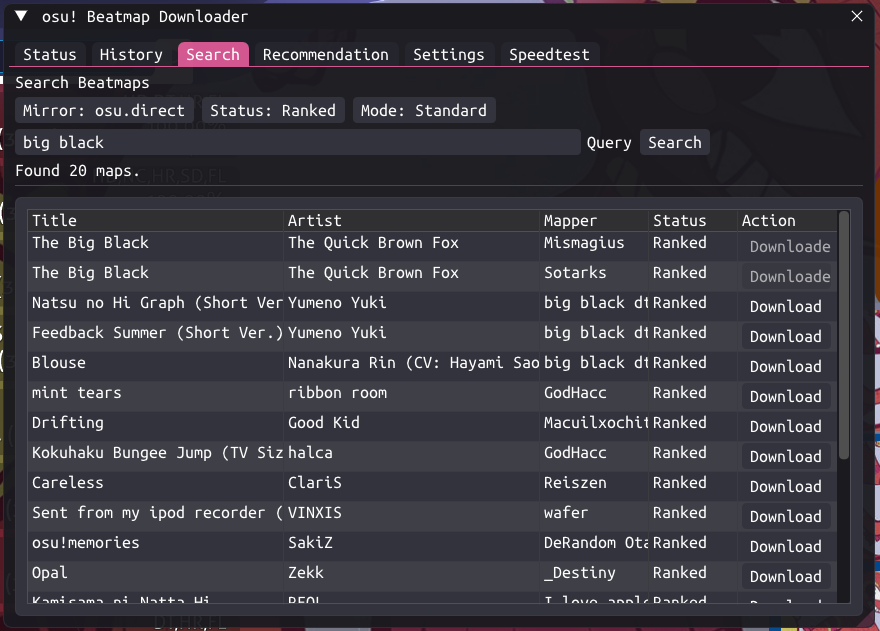
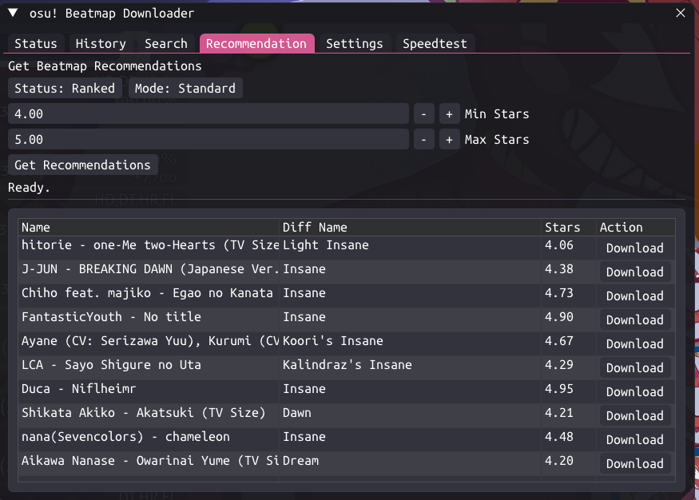
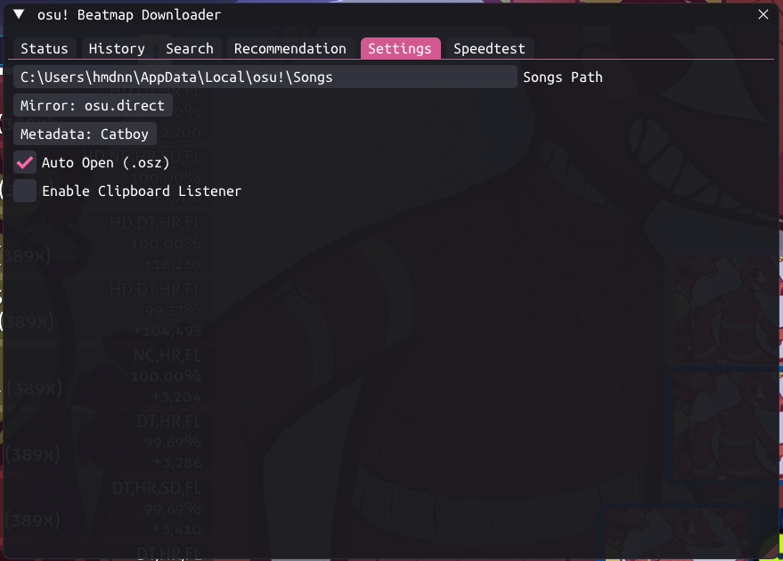
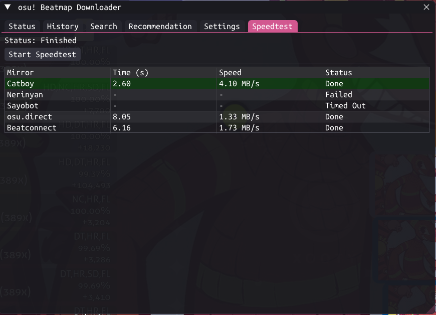

# Osu! In-game Downloader

> A seamless experience for finding and downloading beatmaps without leaving the game client.

<strong>📸 Screenshots</strong>

 

**UI**

**History**

**Search**

**Recommendations**

**Settings**

**Speedtest**

## 🏗️ Architecture
The application operates by injecting into the osu! process and hooking key functions:

1.  **🪝 Hooks**: The entry point. We hook OpenGL (rendering), Input (mouse/keyboard), and Shell (clipboard).
2.  **🖥️ Overlay**: Built with **Dear ImGui**, managing tabs like Search, Settings, and more.
3.  **⚙️ Features**: Background managers for downloads, history, notifications, and speed tests.
4.  **🌐 Providers**: Interfaces for `osu.direct`, `Catboy`, `Nerinyan`, etc.

## 🧩 Components

### Feature Managers (`features/`)
-   **Download Manager**: Handles queues, file writing, and osu! imports.
-   **History Manager**: Tracks downloaded maps to prevent duplicates.
-   **Notification Manager**: In-game toast notifications.
-   **Speedtest Manager**: Network connection quality checks.

### Overlay System (`overlay/`)
-   **Overlay Manager**: ImGui initialization and render loop.
-   **Style Manager**: Theme and styling management.
-   **Input Hooking**: `WndProc`/DirectInput interception.
-   **Tabs System**: Modular tab interface (`OverlayTab`).

### Beatmap Providers (`providers/`)
-   **Provider Interface**: Unified contract for all mirrors.
-   **Implementations**: `OsuDirect`, `Catboy`, `Nerinyan`, `Sayobot`, `Beatconnect`.
-   **ID Resolution**: Converts between Set IDs and Beatmap IDs.

## 💻 Requirements
-   **Build Tools**: Visual Studio 2022 (Desktop development with C++)

## 🚀 Build & Install

1.  Open terminal in the project directory.
2.  Run `msbuild /p:Configuration=Release /p:Platform=x86`.
3.  Inject the DLL into `osu!.exe` using [injector-rs](https://github.com/hmdnnrmn/injector-rs).

## 📜 Credits

Special thanks to:
- **[KyuubiRan/BeatmapDownloader](https://github.com/KyuubiRan/BeatmapDownloader)**
- **[veritas501/Osu-Ingame-Downloader](https://github.com/veritas501/Osu-Ingame-Downloader)**
